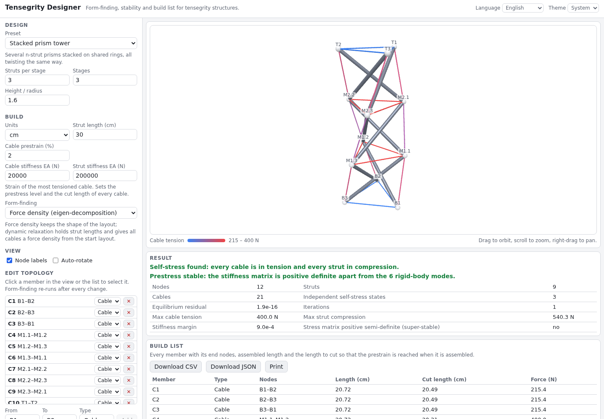

# Tensegrity Designer

Design a tensegrity structure and get everything needed to build it. Pick a preset (T-prism, n-strut prism, six-strut icosahedron, stacked prism towers, X-module, Snelson-style mast), let the form-finder put the nodes in self-equilibrium, check that the prestress makes it stable, and read off every member force. Edit the topology, set the strut length you want (say 30 cm) and export a build list with the cut length of every cable.

**Try it: [hermes98761234.github.io/tensegrity-designer](https://hermes98761234.github.io/tensegrity-designer/)**

[](https://github.com/hermes98761234/tensegrity-designer/actions/workflows/deploy.yml)



## Features

- **Six presets**, each with parameters: T-prism, n-strut prism (3 to 12), icosahedron (expanded octahedron), stacked prism towers, Snelson's planar X-module, and a slender three-strut mast.
- **Two form-finders.** Force density with eigen-decomposition, and dynamic relaxation with kinetic damping.
- **Stability check.** The tangent stiffness matrix is tested for positive definiteness: it reports mechanisms and negative modes. It also tells you whether the stress matrix is positive semi-definite (Connelly's super-stability).
- **Member forces** for a prestress level you set as the strain of the most tensioned cable.
- **Interactive 3D view** (three.js, orbit): struts are thick bars, cables are thin and coloured from blue to red by tension. Click a member to find it in the list.
- **Edit the topology.** Add or remove members, switch a cable to a strut, and the shape is found again. A layout that cannot be self-stressed is flagged instead of drawn as if it worked.
- **Build list.** Every member with type, end-node labels, length in mm, cm, m or inches, the force, and the cable cut length that gives your prestrain. Export as CSV or JSON, or print a clean table.
- **English or Ukrainian, light or dark.** Your inputs are remembered in the browser. The maths runs in a Web Worker.

## How it works

A member between nodes *i* and *j* with tension *t* and length *L* has force density *q = t / L*. In equilibrium the force on each node sums to zero, and with force densities that is linear in the coordinates (Schek, 1974):

`D x = 0`, with `D = Σ q (eᵢ − eⱼ)(eᵢ − eⱼ)ᵀ` (the stress matrix), one equation per coordinate.

A free-standing structure needs `D` to have a four-dimensional null space (x, y, z and the ones vector). The form-finder alternates two steps:

1. Find the self-stress `q` of the current geometry: the near-null vector of `AᵀA`, where `A` is the equilibrium matrix. If there are several, take the one closest to "cables +1, struts −1".
2. Project the coordinates onto the four eigenvectors of `D(q)` with the smallest eigenvalues, and repeat until `D x = 0`.

Dynamic relaxation (Barnes, 1999) instead integrates the nodes with kinetic damping. Cables are zero-rest-length springs with fixed force density, struts are stiff springs that keep their length.

**Stability.** With the self-stress scaled to your prestress level, the tangent stiffness is `K = Σ (EA/L) d dᵀ + (t/L)(I − d dᵀ)`, with unit direction `d`. The structure is prestress stable if `K` is positive definite apart from the 6 rigid-body zero modes. The eigenvalues come from a Jacobi solver.

**Prestress and cut length.** The most tensioned cable gets the strain you choose, `ε = t / EA`. Every other member is scaled by its force, and its cut length is `L / (1 + t / EA)`.

**Checks in the test suite.**

- The twist between the end polygons of an n-strut prism is `α = 90° − 180°/n`, 30° for the T-prism. The test checks that a self-stress exists only at that twist, and that the struts span 150° (= 30° + 120°) around the axis.
- For the icosahedron the 24 cables are equal, the 6 struts are equal, and strut/cable `= √(8/3) ≈ 1.633`. Form-finding turns a regular icosahedron into this shape.
- Equilibrium residuals are about 1e-16, and member forces balance at every node.

References: H.-J. Schek, *The force density method for form finding and computation of general networks*, Computer Methods in Applied Mechanics and Engineering 3 (1974). M. Barnes, *Form finding and analysis of tension structures by dynamic relaxation*, Int. J. Space Structures 14 (1999). A. Tibert and S. Pellegrino, *Review of form-finding methods for tensegrity structures*, Int. J. Space Structures 18 (2003). R. Connelly and W. Whiteley, *Second-order rigidity and prestress stability for tensegrity frameworks*, SIAM J. Discrete Math. 9 (1996).

Limits: members are pin-jointed and linearly elastic, there is no self-weight, and stacked towers share their rings, so a node can carry a strut end from each stage. The X-module is planar.

## Quick start

You need [Node.js](https://nodejs.org/) 22.

```bash
git clone https://github.com/hermes98761234/tensegrity-designer.git
cd tensegrity-designer
npm install
npm run dev       # http://localhost:5173
npm test          # form-finding, stability, build list and i18n tests
npm run build     # static site in dist/
```

## License

MIT.
